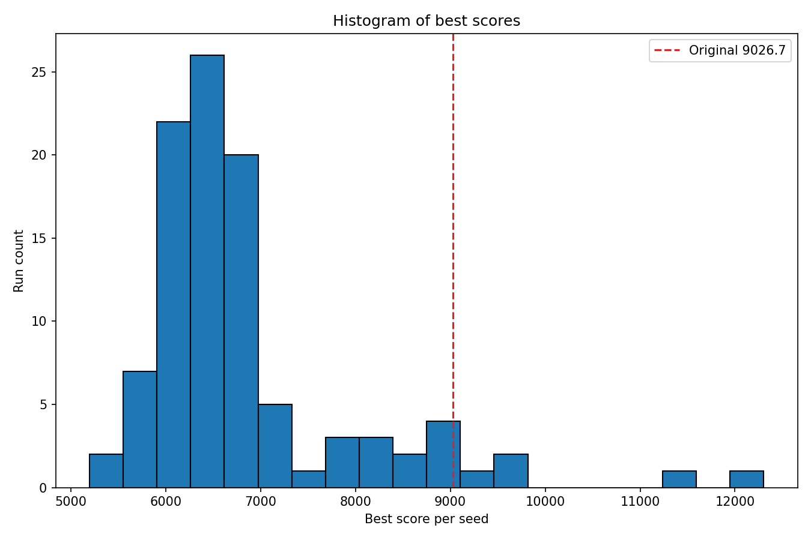
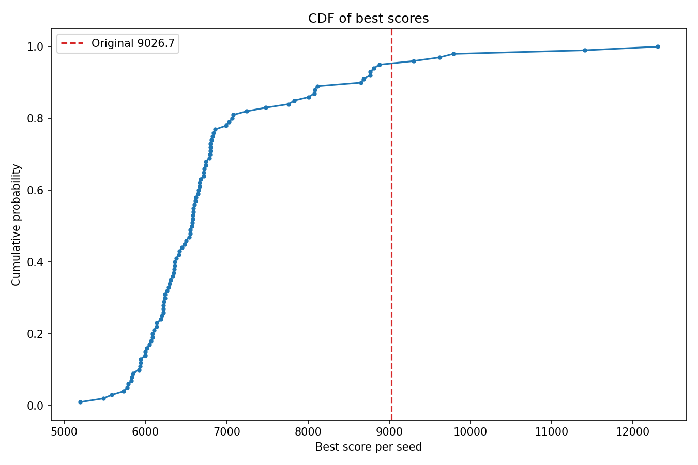
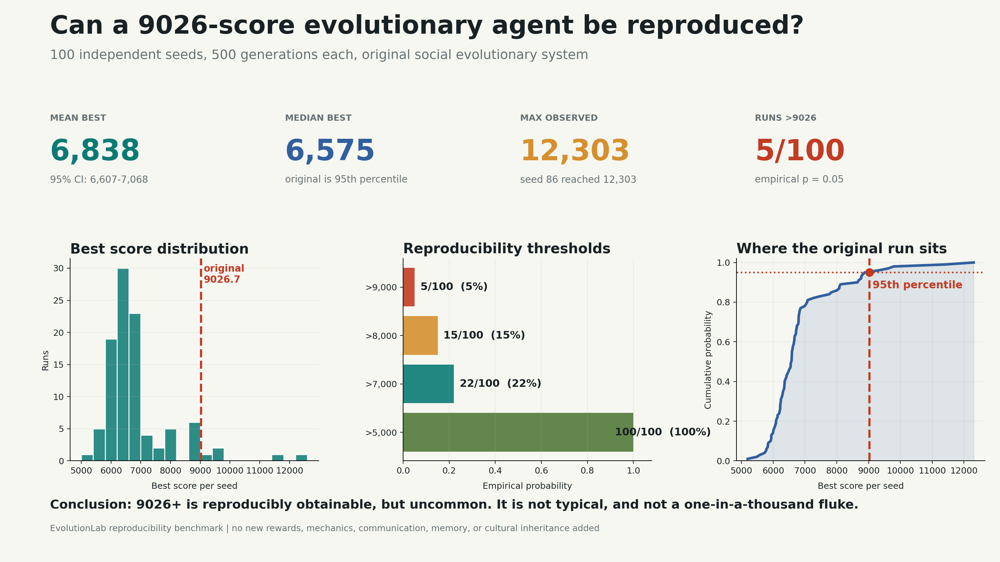
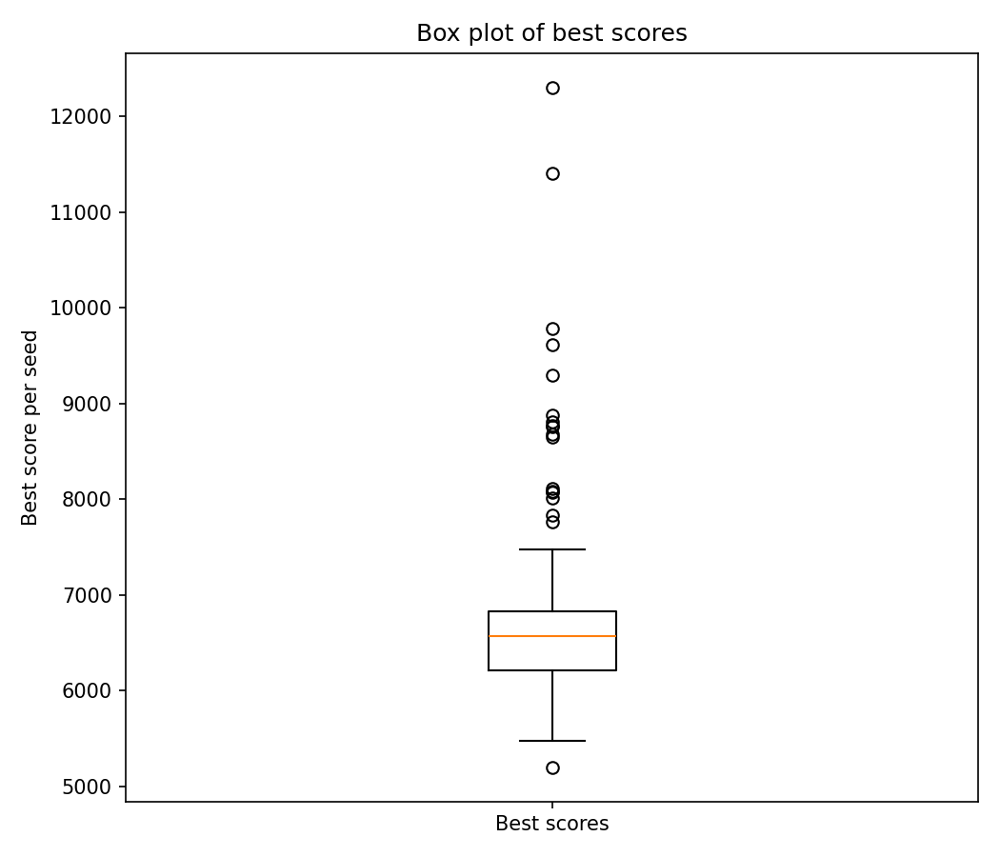
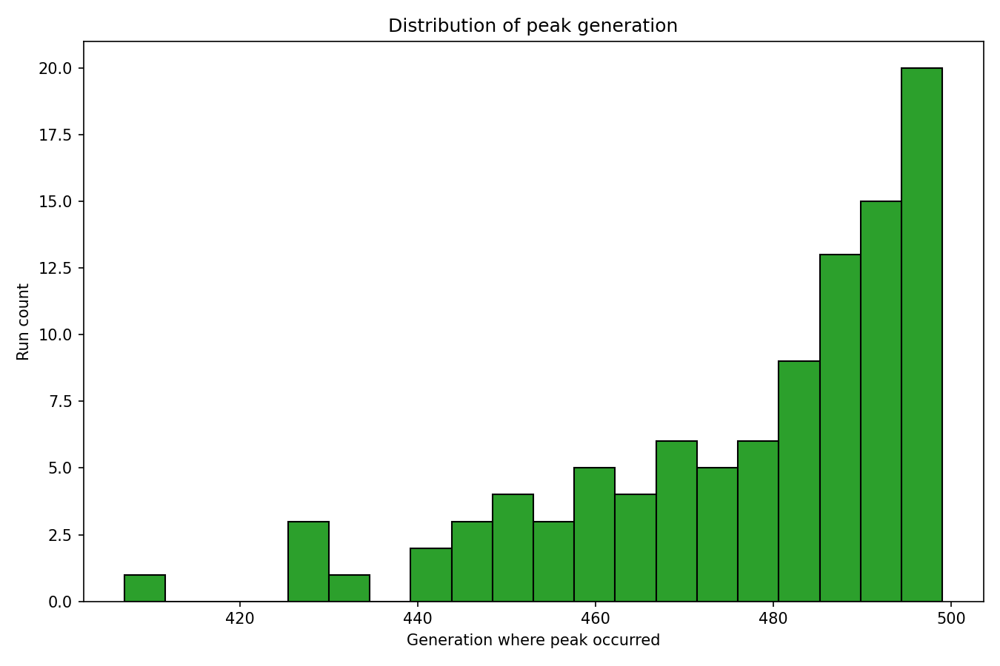
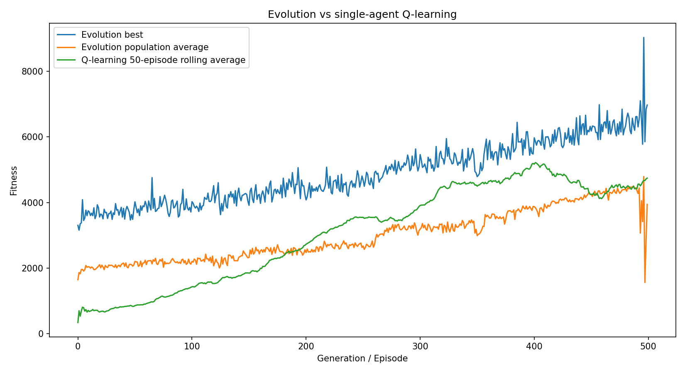
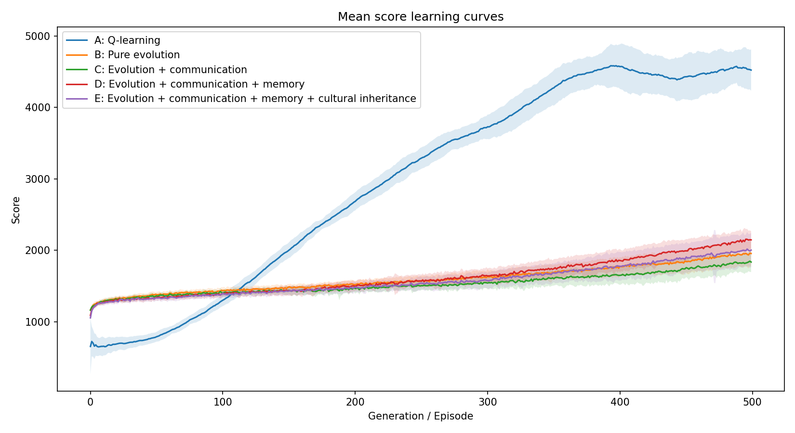

# Results

This file summarizes the result artifacts currently checked into the repository.

## Social Evolution Reproducibility

The original high-scoring social evolutionary run reached `9026.7`. A 100-seed reproducibility benchmark tested how often comparable scores reappear.

| Metric | Value |
|---|---:|
| Seeds | 100 |
| Generations per seed | 500 |
| Agents per generation | 1000 |
| Mean best score | 6837.509 |
| Median best score | 6574.635 |
| Standard deviation | 1160.715 |
| Minimum best score | 5196.924 |
| Maximum best score | 12303.326 |
| Runs above 5000 | 100 / 100 |
| Runs above 7000 | 22 / 100 |
| Runs above 8000 | 15 / 100 |
| Runs above 9000 | 5 / 100 |
| Runs above 9026.7 | 5 / 100 |

## Direct Social Evolution vs Q-Learning Comparison

The direct comparison in `social_vs_q_learning_comparison/comparison_summary.txt` used the last 50 rows as the comparison window.

| Metric | Value |
|---|---:|
| Evolution final population average | 4206.120 |
| Evolution final best average | 6414.899 |
| Evolution best agent ever | 9026.700 |
| Q-learning final rolling average | 4742.522 |
| Q-learning best episode | 8074.750 |

Winner by average: Q-learning.

Winner by best observed score: Evolution.

## 30-Seed Benchmark Matrix

The benchmark matrix compared Q-learning with multiple evolutionary variants.

| Group | Label | Mean | Median | Best | Std | Mean best | Competence gen |
|---|---|---:|---:|---:|---:|---:|---:|
| A | Q-learning | 4522.975 | 4499.710 | 8474.750 | 294.411 | 7674.572 | 181.333 |
| B | Pure evolution | 1905.005 | 1916.334 | 5075.000 | 169.179 | 4647.358 | 0.033 |
| C | Evolution + communication | 1791.117 | 1825.956 | 5174.746 | 135.523 | 4574.194 | 0.000 |
| D | Evolution + communication + memory | 2076.296 | 2069.812 | 5575.000 | 140.177 | 4927.814 | 1.133 |
| E | Evolution + communication + memory + cultural inheritance | 1950.512 | 1959.937 | 5473.704 | 223.011 | 4823.995 | 0.633 |

Summary:

- Best mean score: Q-learning.
- Strongest individual in this benchmark matrix: Q-learning.
- Fastest competence by the benchmark's half-peak metric: Evolution + communication.
- Cultural inheritance did not outperform the memory-only evolutionary group in this run.

## Interpretation

The current data supports a limited claim:

Population-level selection can produce meaningful behavioral improvement and occasional high-scoring outliers in a simple food-seeking environment. Those high-scoring evolutionary agents are reproducibly obtainable, but uncommon. Q-learning is the stronger baseline by average performance in the benchmarked runs.
